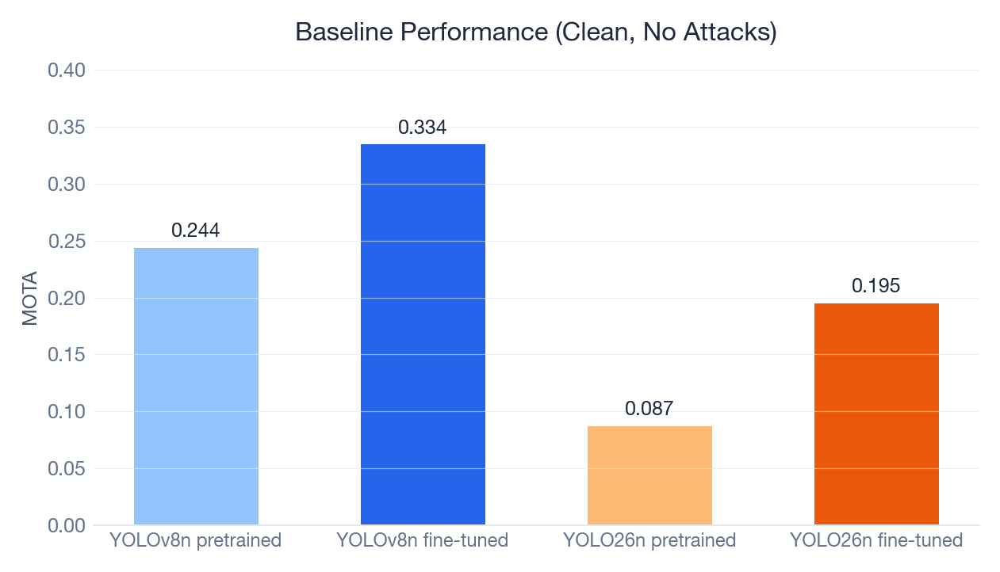
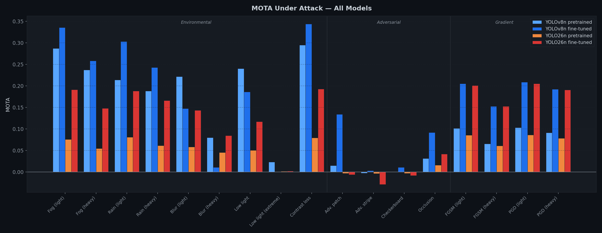
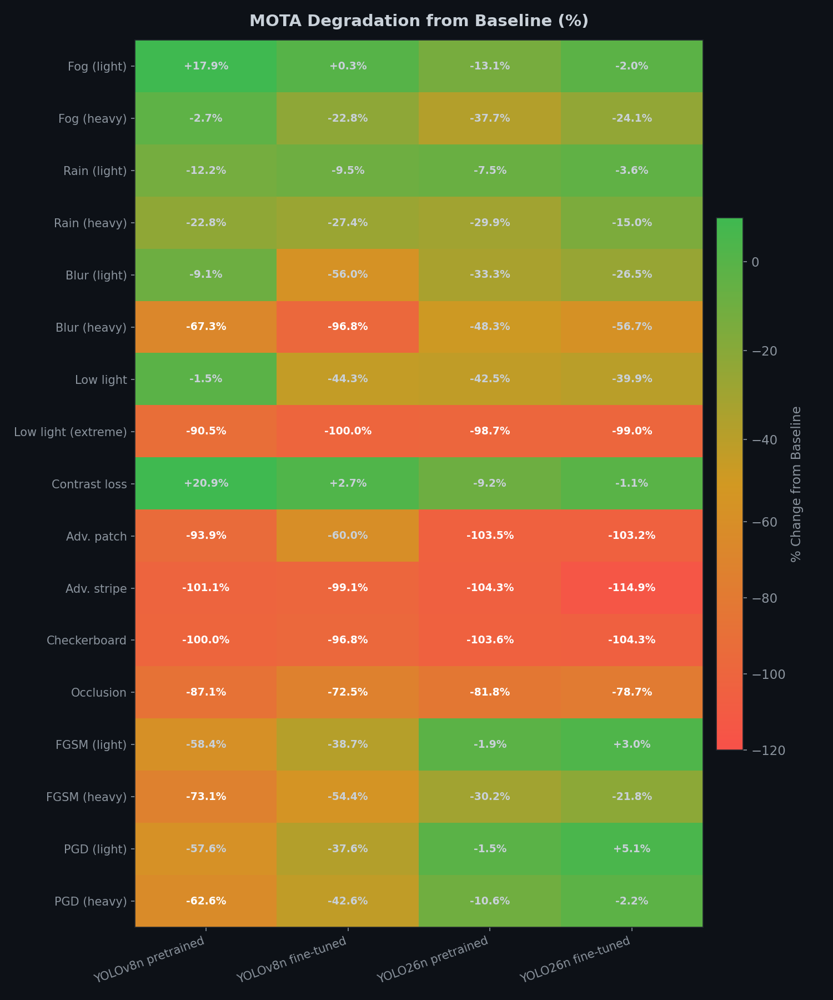
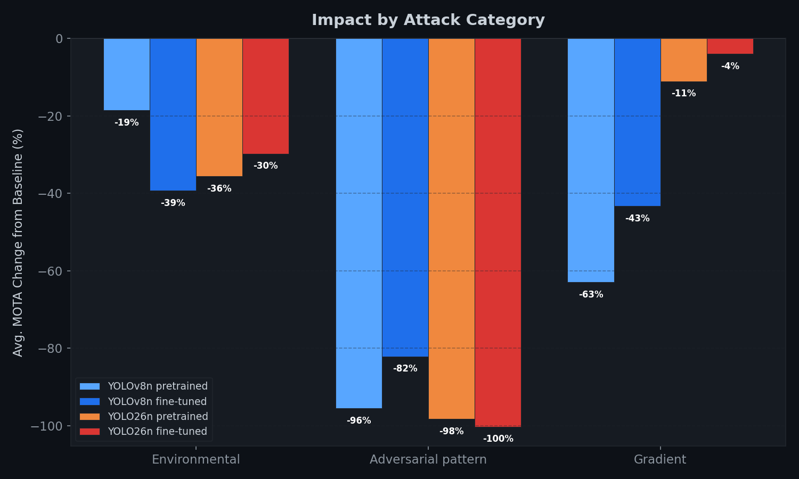
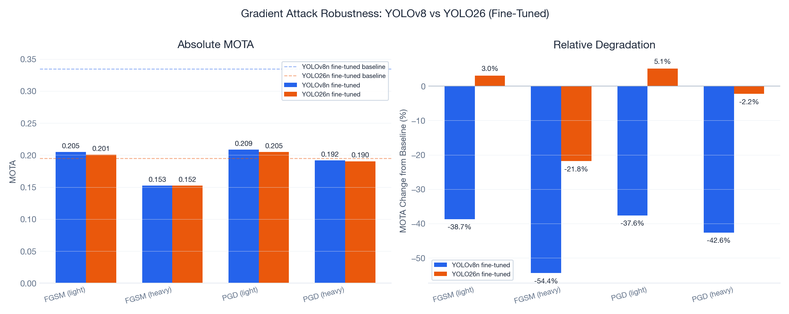

# Adversarial Perception Testing Framework

A ROS2-based framework for evaluating how adversarial conditions degrade object detection and multi-object tracking in drone surveillance. Compares YOLOv8n vs YOLO26n (pretrained and fine-tuned on VisDrone) across 18 attack configurations.

**Core question:** *How fragile is a modern perception pipeline under adversarial conditions, how much does domain-specific fine-tuning help, and does a newer architecture (YOLO26) offer better adversarial robustness than YOLOv8?*

> For architecture details, ROS2 pipeline design, attack implementations, and setup instructions, see [docs/architecture.md](docs/architecture.md).

---

## Baseline Performance



Fine-tuning on VisDrone roughly triples MOTA for both architectures. YOLOv8n outperforms YOLO26n at nano scale — the attention-based architecture's overhead hurts at the smallest model size.

| Model | MOTA | MOTP |
|-------|------|------|
| YOLOv8n pretrained | 0.244 | 0.719 |
| YOLOv8n fine-tuned | 0.334 | 0.762 |
| YOLO26n pretrained | 0.087 | 0.809 |
| YOLO26n fine-tuned | 0.195 | 0.768 |

**Why MOTA is low overall:** VisDrone is one of the hardest MOT benchmarks — tiny objects (10-30px), ~38 per frame, drone altitude. State-of-the-art with full-size models achieves 0.3-0.5 MOTA. This study uses nano variants at 640px. The focus is on **relative degradation** under attack, not absolute performance.

---

## MOTA Under All Attacks



Evaluated on the VisDrone2019-MOT validation set (7 sequences, 2,846 frames, 108,645 ground truth annotations). Non-gradient attacks run on CPU; gradient attacks (FGSM/PGD) on A100 GPU via Modal.

| Attack | v8 pretrained | v8 fine-tuned | v26 pretrained | v26 fine-tuned |
|--------|--------------|--------------|----------------|----------------|
| Baseline (clean) | 0.244 | 0.334 | 0.087 | 0.195 |
| Fog (light) | 0.287 | 0.335 | 0.076 | 0.191 |
| Fog (heavy) | 0.237 | 0.258 | 0.054 | 0.148 |
| Rain (light) | 0.214 | 0.303 | 0.081 | 0.188 |
| Rain (heavy) | 0.188 | 0.243 | 0.061 | 0.166 |
| Blur (light) | 0.221 | 0.147 | 0.058 | 0.143 |
| Blur (heavy) | 0.080 | 0.011 | 0.045 | 0.084 |
| Low light | 0.240 | 0.186 | 0.050 | 0.117 |
| Low light (extreme) | 0.023 | 0.000 | 0.001 | 0.002 |
| Contrast loss | 0.294 | 0.343 | 0.079 | 0.193 |
| Adv. patch | 0.015 | 0.134 | -0.003 | -0.006 |
| Adv. stripe | -0.003 | 0.003 | -0.004 | -0.029 |
| Checkerboard | 0.000 | 0.011 | -0.003 | -0.008 |
| Occlusion | 0.031 | 0.092 | 0.016 | 0.041 |
| FGSM (light) | 0.101 | 0.205 | 0.085 | 0.201 |
| FGSM (heavy) | 0.066 | 0.153 | 0.061 | 0.152 |
| PGD (light) | 0.103 | 0.209 | 0.086 | 0.205 |
| PGD (heavy) | 0.091 | 0.192 | 0.078 | 0.190 |

---

## Degradation Heatmap



Percentage MOTA change from each model's clean baseline. Green = minimal impact, red = severe degradation.

---

## Impact by Attack Category



Adversarial pattern attacks (stripe, checkerboard, patch) are universally devastating regardless of model or fine-tuning. Gradient attacks show the most interesting divergence between architectures.

---

## Gradient Attack Robustness (Key Finding)



**PGD heavy drops YOLOv8n fine-tuned by 42.6% but YOLO26n fine-tuned by only 2.2%.** The attention-based architecture appears to diffuse adversarial gradients, making white-box attacks significantly less effective.

| Attack | v8 FT MOTA | v8 FT drop | v26 FT MOTA | v26 FT drop |
|--------|-----------|-----------|------------|------------|
| FGSM (light) | 0.205 | -38.7% | 0.201 | +3.0%\* |
| FGSM (heavy) | 0.153 | -54.4% | 0.152 | -21.8% |
| PGD (light) | 0.209 | -37.6% | 0.205 | +5.1%\* |
| PGD (heavy) | 0.192 | -42.6% | 0.190 | -2.2% |

\*Light gradient attacks showing slight MOTA improvement on YOLO26 fine-tuned is likely a methodological artifact — the gradient attack wrapper modifies the inference head configuration.

---

## Key Findings

1. **Fine-tuning is essential.** Both models roughly tripled baseline MOTA after fine-tuning on VisDrone. Domain adaptation matters more than architecture choice for absolute tracking performance.

2. **YOLOv8n outperforms YOLO26n at nano scale.** Despite being a newer architecture with attention mechanisms, YOLO26n's design overhead hurts at the smallest model size (0.334 vs 0.195 fine-tuned baseline).

3. **YOLO26 fine-tuned is remarkably robust to gradient attacks.** PGD heavy drops YOLOv8 FT by 42.6% but YOLO26 FT by only 2.2%. The attention-based architecture appears to diffuse adversarial gradients.

4. **Adversarial pattern attacks are devastating regardless of architecture.** Stripe, checkerboard, and patch attacks drive MOTA to zero or negative across all models.

5. **Environmental attacks show a robustness-accuracy tradeoff.** YOLO26 FT shows smaller relative drops under rain and blur despite lower absolute MOTA, suggesting the architecture degrades more gracefully.

6. **Low light (extreme) is a universal failure mode.** All models collapse to MOTA ~0.000 — a fundamental limit of visual perception, not a model-specific weakness.

---

## Tech Stack

**ROS2 Humble** | **YOLOv8 + YOLO26** (Ultralytics) | **ByteTrack** | **PyTorch** | **OpenCV** | **Docker** | **Modal** (cloud A100)

## Quick Start

```bash
git clone <this-repo> && cd adversarial-tracking
docker compose build && docker compose up -d
docker exec -it tracking_adversarial bash
source /tracking_ws/install/setup.bash

# Baseline
ros2 launch tracking_adversarial baseline.launch.py \
    video_source:=/tracking_ws/data/videos/uav0000086_00000_v

# Under attack
ros2 launch tracking_adversarial adversarial.launch.py \
    video_source:=/tracking_ws/data/videos/uav0000086_00000_v \
    attack_type:=fog attack_intensity:=0.7

# Benchmark all attacks
python3 scripts/benchmark.py --sequence-dir /tracking_ws/data/VisDrone2019-MOT-val --model yolov8n.pt

# Generate visualizations
python3 scripts/visualize_results.py
```
